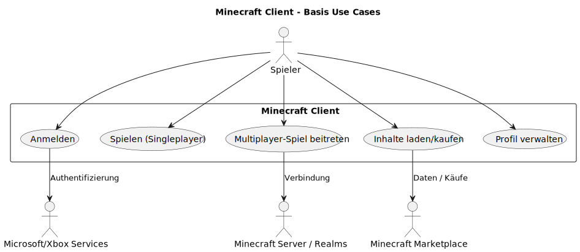
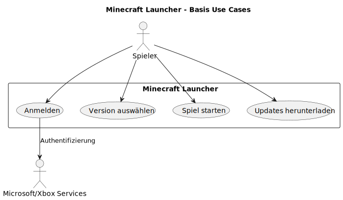
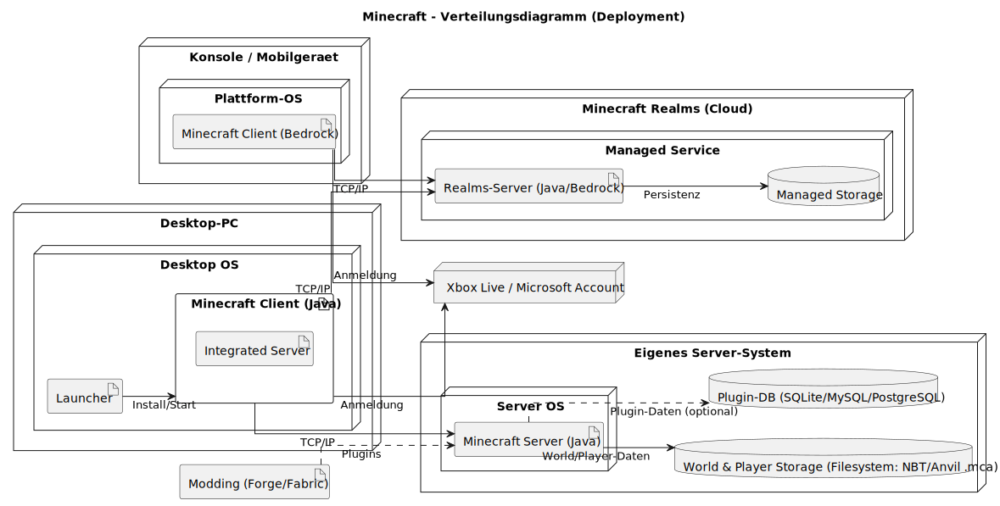

# arc42 Architektur-Dokumentation – Minecraft (didaktisches Modell)

Dieses Dokument folgt dem arc42-Template. Inhalte sind bewusst knapp gehalten und auf die geforderten Kapitel reduziert.

---

## 1. Einführung und Ziele

### 1.1 Aufgabenstellung
- Bereitstellung einer stabilen, performanten und erweiterbaren Spielplattform mit persistenter, chunk-basierter Welt, Einzel- und Mehrspielerbetrieb sowie klaren Erweiterungspunkten.

### 1.2 Qualitätsziele
- Performance und Skalierung (stabile Tick-Rate, effizientes Chunk-Streaming)
- Stabilität und Datenintegrität (verlässliche Speicherung, robuste Ladepfade)
- Erweiterbarkeit (Mods/Plugins/Datapacks mit klaren Schnittstellen)
- Sicherheit und Fairness (serverseitige Autorität, Auth/Permissions)
- Wartbarkeit und Transparenz (Logging, Konfiguration, nachvollziehbare Schnittstellen)

### 1.3 Stakeholder
- Spielende
- Community-Entwickelnde (Mods/Plugins/Tools)
- Server-Administrationen/Hoster
- Hersteller/Produktverantwortliche

---

## 2. Randbedingungen

### 2.1 Technische Randbedingungen
- Sprachen/Plattformen: Java (Java Edition), C++ (Bedrock), Desktop/Mobile/Konsole
- Architekturgrundsatz: durchgängiges Client-Server-Modell, serverseitige Autorität
- Persistenz: Chunk-basierte Speicherung, binäre, strukturierte Formate (z. B. NBT)
- Netzwerk: paketbasiertes Protokoll auf etablierten Transporten

### 2.2 Organisatorische Randbedingungen
- Kontinuierliche Weiterentwicklung bei Schutz bestehender Welten (Kompatibilität)
- Aktive Community-Unterstützung (Erweiterbarkeit, stabile APIs an definierten Punkten)

---

## 3. Kontextabgrenzung

### 3.1 Fachlicher Kontext
- Interaktion Spielende – Spielwelt (Bauen, Sammeln, Kämpfen, Automation).

### 3.2 Technischer Kontext
- Externe Dienste: Authentifizierung/Accounts, Plattform-Distribution, optionale Telemetrie.
- Schnittstellen: Ressourcen-/Datapacks, Plugin-/Modding-Schnittstellen.

### 3.3 Kontextdiagramm

### 3.4 Anwendungsfalldiagramm

---

## 4. Lösungsstrategie
- Serverseitig autoritative Spiel- und Konsistenzlogik
- Chunk-basierte Weltrepräsentation und Streaming
- Event-/Tick-getriebene Verarbeitung, deterministische Regeln
- Erweiterbarkeit über definierte Extension-Points (Datapacks/Plugins)
- Klare Trennung von Client-Rendering und Server-Logik

---

## 5. Bausteinsicht
- Client: Rendering, Eingabe, UI, lokaler Cache
- Server: Welt-/Spielzustand, Regeln, KI, Weltspeicher
- Persistenz: Welt-/Spieler-/Konfiguration in strukturierten Formaten
- Netzwerk: Sitzungs-/Paketverwaltung, Kompression/Serialisierung

---

## 6. Laufzeitsicht
- Verbindungsaufbau: Client authentifiziert, Server synchronisiert Session/Initial-Chunks.
- Spieltakt: Server-Ticks verarbeiten Eingaben, Entities, Physik und senden Deltas.

---

## 7. Verteilungssicht
- Typische Topologie: Clients – dedizierter Server 

### 7.1 Verteildiagramm

---

## 8. Querschnittliche Konzepte
- Persistenz/Dateiformate (z. B. NBT) und Migration
- Konfiguration/Logging/Monitoring
- Sicherheit (AuthN/Z, Rechte, Anti-Cheat-Grundsätze)
- Erweiterbarkeit (Datapacks/Plugins, Versionierung von APIs)
- Fehler- und Ressourcenmanagement (Speicher, Threads, IO)

---

## 9. Architekturentscheidungen
- Client-Server mit serverseitiger Autorität für Konsistenz und Fairness
- Chunking als Skalierungs- und Streaming-Strategie
- Erweiterbarkeit über klar abgegrenzte Extension-Points
- Binäre, strukturierte Datenformate für Welten und Zustände

---

## 10. Qualitätsanforderungen (Szenarien)
- Performance: Welt-Streaming liefert sichtbare Chunks in ≤ X ms.
- Stabilität: Welt-Speicheroperationen bleiben konsistent bei Crash/Recovery.
- Sicherheit: Unautorisierte Aktionen werden serverseitig verworfen/protokolliert.

---

## 11. Risiken und technische Schulden
- Cheat-/Exploit-Risiken und Angriffsfläche im Netzwerkprotokoll
- Kompatibilität alter Weltdaten bei Format-/Regeländerungen
- Interoperabilität/Isolation zwischen Mods/Plugins

---

## 12. Glossar

### 12.1 Inhalt
Die wichtigsten fachlichen und technischen Begriffe, die beim Beschreiben der Minecraft-Referenzarchitektur verwendet werden.  
Das Glossar dient ausserdem als Referenz für Übersetzungen zwischen deutsch- und englischsprachigen Stakeholdern.

### 12.2 Motivation
Eindeutig definierte Begriffe stellen sicher, dass alle Stakeholder

- ein gemeinsames Verständnis zentraler Konzepte haben.
- keine mehrdeutigen Synonyme oder Homonyme verwenden.

### 12.3 Form

- Einfache Tabelle mit den Spalten `Begriff` und `Definition`.
- Zusätzlich eine Spalte `Englischer Begriff` für Übersetzungen.

### 12.4 Begriffe

| Begriff   | Definition                                                                                                   | Englischer Begriff     |
|----------|--------------------------------------------------------------------------------------------------------------|------------------------|
| Chunk    | Fester Abschnitt der Spielwelt, der gemeinsam geladen, gespeichert und über das Netz übertragen wird.       | Chunk                  |
| Tick     | Fester Verarbeitungsschritt des Servers, in dem Spielregeln, Physik und Zustände aktualisiert werden.       | Tick                   |
| NBT      | Binäres Tag-Format zur strukturierten Speicherung von Weltdaten, Spielerzuständen usw.                      | Named Binary Tag (NBT) |
| Datapack | Paket mit in Dateien definierten Spielinhalten und Regeln (z. B. Loot-Tabellen, Advancements, Funktionen).  | Data Pack              |
| Plugin   | Serverseitige Erweiterung, die zusätzliche Logik über definierte Erweiterungspunkte einbindet.              | Plugin                 |
| Welt     | Gesamtheit aller Chunks, Dimensionen und gespeicherten Zustände eines Spielstands.                          | World                  |
| Dimension| Logisch getrennte Teilwelt mit eigener Geometrie und eigenen Regeln (z. B. Overworld, Nether).              | Dimension              |
| Entity   | Dynamisches Objekt in der Welt, z. B. Spieler, Mobs, Projektile oder Item-Stacks.                           | Entity                 |
| Block    | Kleinstes statisches Bauelement der Spielwelt, z. B. Stein, Erde oder Redstone-Komponente.                  | Block                  |
| Seed     | Startwert zur deterministischen Generierung einer Welt.                                                     | Seed                   |
| Server   | Autoritative Instanz, die Weltzustand, Regeln und Persistenz verwaltet.                                     | Server                 |
| Client   | Spielprogramm der Nutzenden für Rendering, Eingabe und Kommunikation mit dem Server.                        | Client                 |

